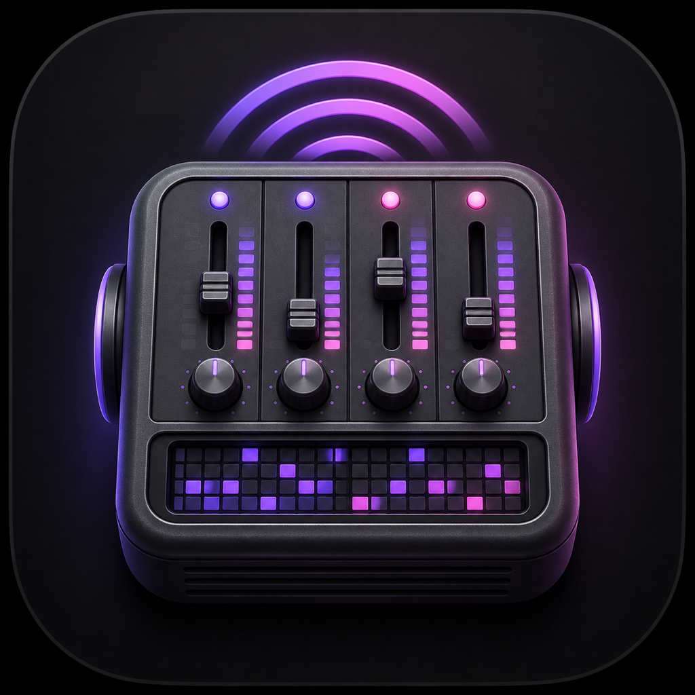

# ModRadio

Tracker music in your menu bar.

[Download](https://github.com/pdparchitect/modradio/releases) · [Documentation](docs/README.md) · [Development](docs/development.md)

Discover a continuous stream of MOD and XM music. Pause, skip, seek, and adjust the volume from the menu bar, or use your Mac’s media controls. The next track is prepared in memory for quick transitions.

## Download

Requires macOS 15 or later on Apple Silicon. Download `ModRadio-arm64.zip` from [Releases](https://github.com/pdparchitect/modradio/releases), unzip it, and move ModRadio to Applications.

## Get started

1. Open ModRadio and click the radio icon in your menu bar.
2. Choose **Play Random MOD or XM**.
3. Use the menu or your keyboard’s media controls to pause or skip a track.

Music comes from BassoonTracker and The Mod Archive and plays locally. Downloaded tracks stay in memory.

## Documentation

- [Using ModRadio](docs/usage.md)
- [Security and privacy](docs/security.md)
- [Development](docs/development.md)
- [Architecture](docs/architecture.md)
- [Changelog](CHANGELOG.md)
