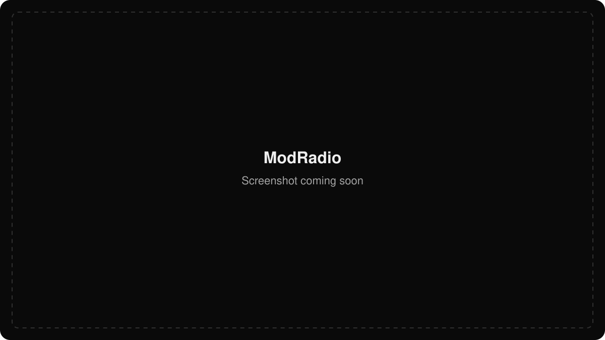

# ModRadio

**An endless stream of tracker music in your Mac’s menu bar.**

  
  
  
  

[Download](#download) · [Documentation](docs/README.md) · [Development](docs/development.md) · [Security](docs/security.md)

<!-- Replace the placeholder image below with the ModRadio screenshot when available. -->

  

Discover a continuous stream of MOD and XM music from your menu bar. ModRadio
plays each track locally and lines up the next one while you listen. Pause,
skip, seek, and adjust the volume from the menu or your Mac’s media controls.

## Download

The first public build is being prepared for macOS 15 or later on Apple Silicon.

When available, download `ModRadio-arm64.zip` from **[Releases](https://github.com/pdparchitect/modradio/releases)**, unzip it, and move ModRadio to **Applications**.

See [Downloads and updates](docs/releases.md) for installation and update controls, or [Development](docs/development.md) to build from source.

## Get started

1. Open ModRadio and click the radio icon in your menu bar.
2. Choose **Play Random MOD or XM** to start listening.
3. Use the menu or your keyboard’s media controls to pause or skip a track.

## Documentation

- [Using ModRadio and media controls](docs/usage.md)
- [Security, privacy, and updates](docs/security.md)
- [Development and testing](docs/development.md)
- [Architecture](docs/architecture.md)
- [Downloads and updates](docs/releases.md)
- [All documentation](docs/README.md)
- [Changelog](CHANGELOG.md)
